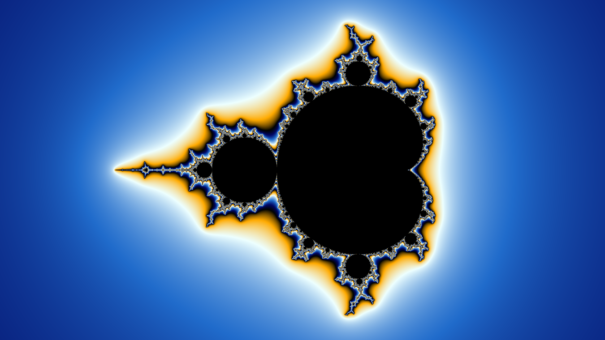
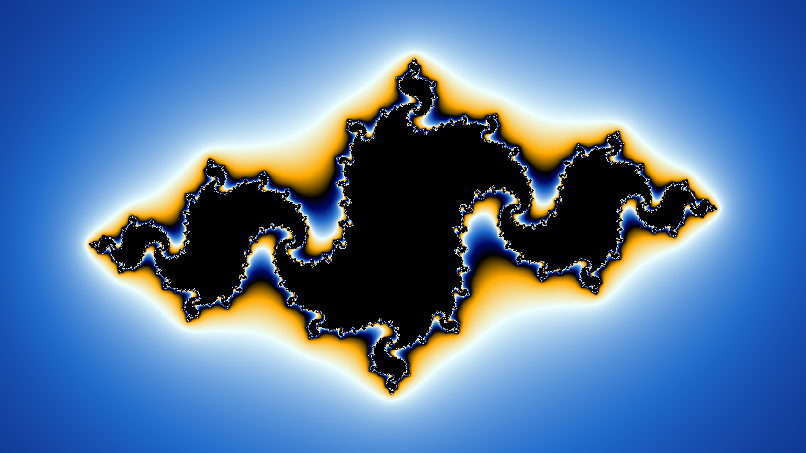
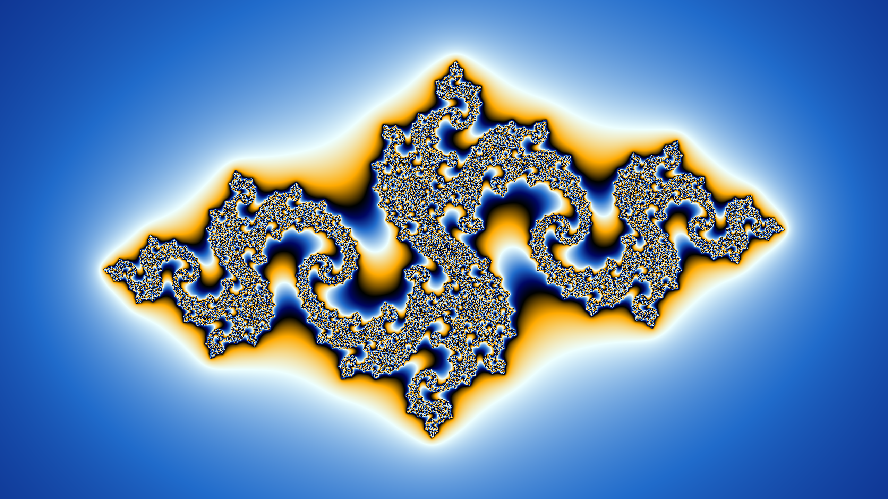
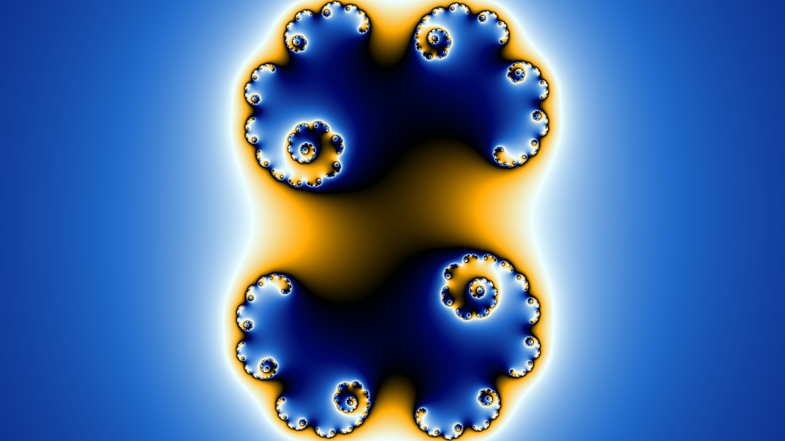
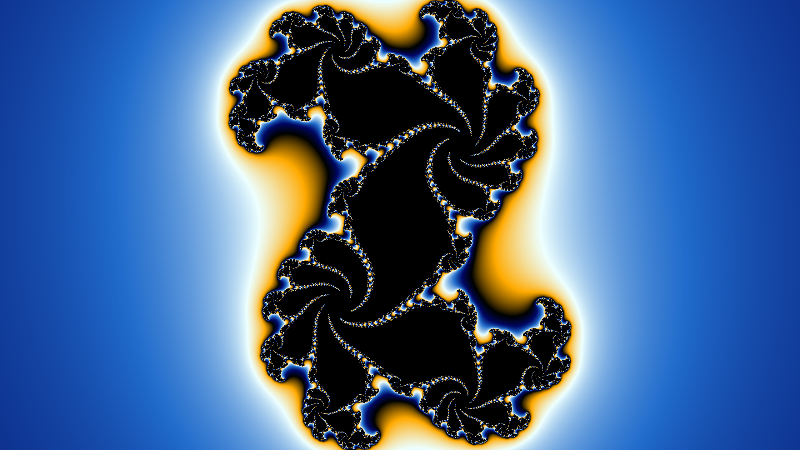
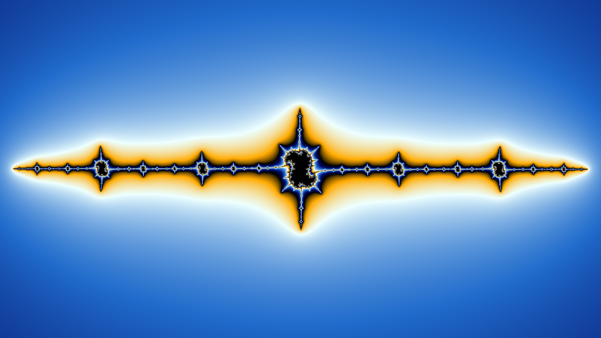

# GPU based fractal renderer

This is a real-time fractal renderer written using modern OpenGL that shows the mandel brot set and julia sets with double point precision and a cyclic colour pallete.

# How to use

- Install the dependencies
    - pyOpengl
    - pygame
    - numpy
- Run the 2dFractals.py script
- Use wasd to pan around, and q/e to zoom
- Click on any point of the mandel brot set to render the julia set of the corresponding complex number
- Press the arrow keys while looking at a julia set to adjust the complex number it is derived from.
- Press escape to return from a julia set to the mandelbrot set
- Press escape to exit from the mandelbrot set.

# Gallery
First 2 are images of the mandelbrot set.
The last 5 are images of different julia sets

